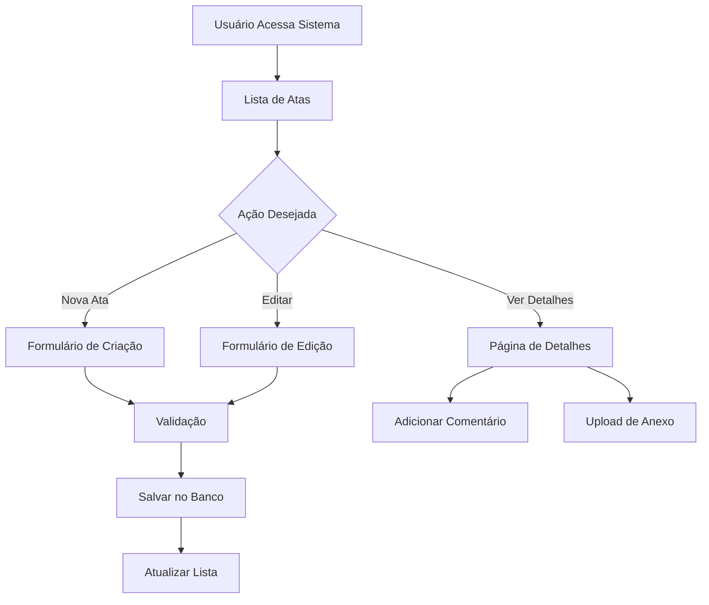
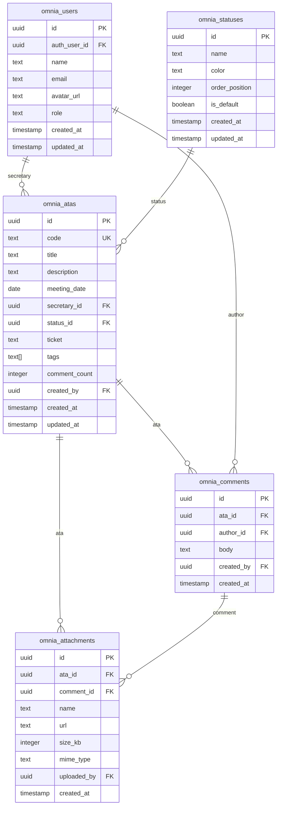

# Sistema de Atas - OMNIA

## Visão Geral

O sistema de atas do OMNIA é um módulo completo de gerenciamento de atas de assembleias condominiais que permite criação, edição, comentários, anexos e controle de status. Este documento serve como referência técnica completa para desenvolvimento e manutenção.

---

## 1. Mecanismos de Atas

### 1.1 Processo de Criação

#### Fluxo de Criação:
1. **Acesso**: Usuários autenticados com roles `ADMIN` ou `SECRETARIO` podem criar atas
2. **Formulário**: Preenchimento do `AtaForm` com validação via Zod
3. **Validação**: Campos obrigatórios (título, status) são validados
4. **Geração de Código**: Sistema gera automaticamente código sequencial (A-0001, A-0002, etc.)
5. **Persistência**: Dados salvos via `atasRepoSupabase.create()`
6. **Notificação**: Feedback visual via toast/sonner
7. **Atualização**: Estado global atualizado via Zustand store

#### Campos Obrigatórios:
- **Título**: Descrição concisa da ata
- **Status**: Status inicial (padrão definido no sistema)

#### Campos Opcionais:
- **Descrição**: Detalhamento da ata
- **Data da Assembleia**: Data de realização da assembleia
- **Secretário**: Usuário responsável pela secretaria
- **Responsável**: Usuário responsável pela ata
- **Tags**: Categorização livre
- **Ticket**: Código/referência externa
- **Anexos**: Arquivos relacionados

### 1.2 Modelo Padrão

```typescript
export interface Ata {
  id: string;                    // Código gerado automaticamente (A-0001)
  title: string;                 // Título da ata
  description?: string;          // Descrição detalhada
  meetingDate?: string;          // Data da assembleia
  createdAt: string;            // Data de criação
  updatedAt: string;            // Data de atualização
  secretary?: UserRef;          // Secretário responsável
  responsible?: UserRef;        // Responsável pela ata
  statusId: string;             // ID do status atual
  ticket?: string;              // Código/referência externa
  tags?: string[];              // Tags de categorização
  commentCount?: number;        // Contador de comentários
  attachments?: Attachment[];   // Anexos da ata
  comments?: Comment[];         // Comentários da ata
}
```

### 1.3 Processo de Aprovação

#### Estados de Aprovação:
1. **Rascunho**: Ata em elaboração
2. **Em Revisão**: Aguardando revisão
3. **Aprovada**: Ata aprovada e finalizada
4. **Rejeitada**: Ata rejeitada, necessita correções

#### Fluxo de Aprovação:
- Apenas usuários com role `ADMIN` ou `SECRETARIO` podem alterar status
- Transições de status são registradas no histórico
- Notificações automáticas para mudanças de status

---

## 2. Funcionalidades do Sistema

### 2.1 Descrição Técnica

O sistema de atas implementa:
- **CRUD Completo**: Criação, leitura, atualização e exclusão
- **Sistema de Comentários**: Comentários aninhados com anexos
- **Gerenciamento de Anexos**: Upload, download e visualização
- **Controle de Acesso**: Baseado em roles (RLS)
- **Real-time Updates**: Sincronização automática via Supabase
- **Busca e Filtros**: Busca textual e filtros por status
- **Responsividade**: Interface adaptável a diferentes dispositivos

### 2.2 Requisitos

#### Funcionais:
- [x] Criar, editar e excluir atas
- [x] Sistema de comentários
- [x] Upload e gerenciamento de anexos
- [x] Controle de status
- [x] Busca e filtros
- [x] Geração automática de códigos
- [x] Sistema de tags
- [x] Atribuição de responsáveis

#### Não Funcionais:
- [x] Performance: Carregamento < 2s
- [x] Segurança: Autenticação obrigatória
- [x] Usabilidade: Interface intuitiva
- [x] Escalabilidade: Suporte a múltiplos usuários
- [x] Disponibilidade: 99.9% uptime

### 2.3 Fluxos de Trabalho

#### Fluxo Principal:


---

## 3. Arquitetura

### 3.1 Diagrama de Componentes

```
src/
├── components/atas/              # Componentes específicos de atas
│   ├── AtaForm.tsx              # Formulário de criação/edição
│   ├── AttachmentsList.tsx      # Lista de anexos
│   ├── CommentInput.tsx         # Input para comentários
│   ├── CommentsList.tsx         # Lista de comentários
│   ├── FileUploader.tsx         # Upload de arquivos
│   ├── StatusSelect.tsx         # Seletor de status
│   └── TagInput.tsx             # Input de tags
├── pages/
│   ├── Atas.tsx                # Página principal de listagem
│   ├── AtaDetail.tsx           # Página de detalhes da ata
│   ├── AtaEdit.tsx             # Página de edição
│   └── AtaNew.tsx              # Página de criação
├── store/
│   └── atas.store.ts           # Store Zustand para gerenciamento de estado
└── repositories/
    └── atasRepo.supabase.ts    # Repository para operações com Supabase
```

### 3.2 Tecnologias

#### Frontend:
- **React 18**: Framework principal
- **TypeScript**: Tipagem estática
- **Vite**: Build tool e dev server
- **Tailwind CSS**: Framework de estilos
- **shadcn/ui**: Sistema de componentes
- **React Hook Form**: Gerenciamento de formulários
- **Zod**: Validação de esquemas
- **Zustand**: Gerenciamento de estado
- **React Router**: Roteamento
- **date-fns**: Manipulação de datas
- **Lucide React**: Ícones

#### Backend:
- **Supabase**: Backend as a Service
- **PostgreSQL**: Banco de dados
- **Row Level Security**: Controle de acesso
- **Real-time**: Atualizações em tempo real
- **Storage**: Armazenamento de arquivos

### 3.3 Padrões Arquiteturais

#### Repository Pattern:
```typescript
class AtasRepoSupabase {
  async list(search?: string, statusFilter?: string[]): Promise<Ata[]>
  async getById(id: string): Promise<Ata | null>
  async create(data: Omit<Ata, 'id' | 'createdAt' | 'updatedAt'>): Promise<Ata>
  async update(id: string, data: Partial<Ata>): Promise<Ata | null>
  async remove(id: string): Promise<boolean>
}
```

#### Store Pattern (Zustand):
```typescript
interface AtasStore {
  atas: Ata[]
  statuses: Status[]
  loading: boolean
  error: string | null
  
  loadAtas: (search?: string, statusFilter?: string[]) => Promise<void>
  createAta: (data: Omit<Ata, 'id' | 'createdAt' | 'updatedAt'>) => Promise<Ata>
  updateAta: (id: string, data: Partial<Ata>) => Promise<Ata | null>
  deleteAta: (id: string) => Promise<boolean>
}
```

---

## 4. Estilos e Design

### 4.1 Guia de Estilo

#### Sistema de Cores:
- **Primária**: `#3B82F6` (Azul)
- **Secundária**: `#10B981` (Verde)
- **Sucesso**: `#10B981` (Verde)
- **Aviso**: `#F59E0B` (Amarelo)
- **Erro**: `#EF4444` (Vermelho)
- **Neutro**: `#6B7280` (Cinza)

#### Status Colors:
- **Rascunho**: `#6B7280` (Cinza)
- **Em Revisão**: `#F59E0B` (Amarelo)
- **Aprovada**: `#10B981` (Verde)
- **Rejeitada**: `#EF4444` (Vermelho)

### 4.2 Componentes UI/UX

#### Botão "Minhas Atas":
```tsx
<button
  onClick={() => setShowOnlyMyAtas(!showOnlyMyAtas)}
  className={`
    w-12 h-12 rounded-full flex items-center justify-center text-sm font-medium transition-all duration-200
    ${showOnlyMyAtas 
      ? 'bg-yellow-400 text-yellow-900 shadow-lg ring-2 ring-yellow-300' 
      : 'bg-gray-200 text-gray-600 hover:bg-gray-300'
    }
  `}
  title="Filtrar minhas atas"
>
  {userInitials || <User className="w-5 h-5" />}
</button>
```

#### Card de Ata:
```tsx
<Card className="hover:shadow-md transition-shadow">
  <CardHeader>
    <div className="flex justify-between items-start">
      <CardTitle className="text-lg">{ata.title}</CardTitle>
      <Badge variant={getStatusVariant(ata.statusId)}>
        {getStatusName(ata.statusId)}
      </Badge>
    </div>
  </CardHeader>
  <CardContent>
    <div className="space-y-2">
      <p className="text-sm text-muted-foreground">{ata.description}</p>
      <div className="flex items-center gap-4 text-xs text-muted-foreground">
        <span>📅 {formatDate(ata.meetingDate)}</span>
        <span>💬 {ata.commentCount} comentários</span>
        <span>📎 {ata.attachments?.length || 0} anexos</span>
      </div>
    </div>
  </CardContent>
</Card>
```

### 4.3 Padrões de Interação

#### Navegação:
- **Breadcrumbs**: Navegação hierárquica
- **Tabs**: Organização de conteúdo
- **Modais**: Ações secundárias
- **Dropdowns**: Menus de ação

#### Feedback:
- **Toasts**: Notificações temporárias
- **Loading States**: Indicadores de carregamento
- **Empty States**: Estados vazios informativos
- **Error States**: Tratamento de erros

---

## 5. Estrutura de Dados

### 5.1 Diagrama de Tabelas



### 5.2 Relacionamentos

#### Principais Relacionamentos:
1. **Ata → Status**: Cada ata possui um status (obrigatório)
2. **Ata → Usuário (Secretário)**: Ata pode ter um secretário atribuído
3. **Ata → Comentários**: Ata pode ter múltiplos comentários
4. **Ata → Anexos**: Ata pode ter múltiplos anexos
5. **Comentário → Anexos**: Comentário pode ter múltiplos anexos
6. **Comentário → Usuário**: Cada comentário tem um autor

### 5.3 Tipos de Dados

#### Interface Principal:
```typescript
export interface Ata {
  id: string;                    // Código único (A-0001)
  title: string;                 // Título da ata
  description?: string;          // Descrição opcional
  meetingDate?: string;          // Data da assembleia
  createdAt: string;            // Data de criação
  updatedAt: string;            // Data de atualização
  secretary?: UserRef;          // Secretário responsável
  responsible?: UserRef;        // Responsável pela ata
  statusId: string;             // ID do status
  ticket?: string;              // Código externo
  tags?: string[];              // Tags de categorização
  commentCount?: number;        // Contador de comentários
  attachments?: Attachment[];   // Anexos da ata
  comments?: Comment[];         // Comentários da ata
}

export interface Comment {
  id: string;
  author: UserRef;
  body: string;
  createdAt: string;
  attachments?: Attachment[];
}

export interface Attachment {
  id: string;
  name: string;
  url: string;
  sizeKB?: number;
  mime?: string;
  createdAt: string;
}

export interface Status {
  id: string;
  name: string;
  color: string;
  order: number;
  isDefault?: boolean;
}

export interface UserRef {
  id: string;
  name: string;
  email: string;
  roles: Role[];
  avatarUrl?: string;
  color?: string;
}

export type Role = 'ADMIN' | 'SECRETARIO' | 'LEITOR';
```

#### Schema de Validação:
```typescript
const ataSchema = z.object({
  title: z.string().min(1, "Título é obrigatório"),
  description: z.string().optional(),
  meetingDate: z.string().optional(),
  secretaryId: z.string().optional(),
  responsibleId: z.string().optional(),
  statusId: z.string().min(1, "Status é obrigatório"),
  ticket: z.string().optional(),
  tags: z.string().optional()
});
```

---

## 6. Elementos de Banco de Dados

### 6.1 Triggers

#### Atualização Automática de Timestamps:
```sql
CREATE OR REPLACE FUNCTION public.update_updated_at_column()
RETURNS TRIGGER AS $$
BEGIN
  NEW.updated_at = now();
  RETURN NEW;
END;
$$ LANGUAGE plpgsql;

CREATE TRIGGER update_omnia_atas_updated_at
  BEFORE UPDATE ON public.omnia_atas
  FOR EACH ROW
  EXECUTE FUNCTION public.update_updated_at_column();
```

#### Contagem Automática de Comentários:
```sql
CREATE OR REPLACE FUNCTION public.update_ata_comment_count()
RETURNS TRIGGER AS $$
BEGIN
  IF TG_OP = 'INSERT' THEN
    UPDATE public.omnia_atas 
    SET comment_count = comment_count + 1 
    WHERE id = NEW.ata_id;
    RETURN NEW;
  ELSIF TG_OP = 'DELETE' THEN
    UPDATE public.omnia_atas 
    SET comment_count = comment_count - 1 
    WHERE id = OLD.ata_id;
    RETURN OLD;
  END IF;
  RETURN NULL;
END;
$$ LANGUAGE plpgsql;

CREATE TRIGGER update_comment_count_trigger
  AFTER INSERT OR DELETE ON public.omnia_comments
  FOR EACH ROW
  EXECUTE FUNCTION public.update_ata_comment_count();
```

### 6.2 Funções

#### Geração Automática de Códigos:
```sql
CREATE OR REPLACE FUNCTION generate_ata_code()
RETURNS TEXT AS $$
DECLARE
  next_number INTEGER;
  new_code TEXT;
BEGIN
  -- Busca o próximo número sequencial
  SELECT COALESCE(MAX(CAST(SUBSTRING(code FROM 3) AS INTEGER)), 0) + 1
  INTO next_number
  FROM public.omnia_atas
  WHERE code ~ '^A-[0-9]+$';
  
  -- Formata o código com zero padding
  new_code := 'A-' || LPAD(next_number::TEXT, 4, '0');
  
  RETURN new_code;
END;
$$ LANGUAGE plpgsql;
```

### 6.3 Procedures

#### Recontagem de Comentários:
```sql
CREATE OR REPLACE PROCEDURE recount_ata_comments()
LANGUAGE plpgsql
AS $$
BEGIN
  UPDATE public.omnia_atas 
  SET comment_count = (
    SELECT COUNT(*) 
    FROM public.omnia_comments 
    WHERE ata_id = omnia_atas.id
  );
END;
$$;
```

### 6.4 Políticas RLS

#### Políticas para omnia_atas:
```sql
-- Visualização: Todos os usuários autenticados
CREATE POLICY "Anyone can view atas" ON public.omnia_atas
  FOR SELECT USING (auth.role() = 'authenticated');

-- Criação: Apenas SECRETARIO e ADMIN
CREATE POLICY "Secretarios and Admins can create atas" ON public.omnia_atas
  FOR INSERT WITH CHECK (
    EXISTS (
      SELECT 1 FROM public.omnia_users 
      WHERE auth_user_id = auth.uid() AND role IN ('ADMIN', 'SECRETARIO')
    )
  );

-- Atualização: Apenas SECRETARIO e ADMIN
CREATE POLICY "Secretarios and Admins can update atas" ON public.omnia_atas
  FOR UPDATE USING (
    EXISTS (
      SELECT 1 FROM public.omnia_users 
      WHERE auth_user_id = auth.uid() AND role IN ('ADMIN', 'SECRETARIO')
    )
  );

-- Exclusão: Apenas ADMIN
CREATE POLICY "Admins can delete atas" ON public.omnia_atas
  FOR DELETE USING (
    EXISTS (
      SELECT 1 FROM public.omnia_users 
      WHERE auth_user_id = auth.uid() AND role = 'ADMIN'
    )
  );
```

#### Políticas para omnia_comments:
```sql
-- Visualização: Todos os usuários autenticados
CREATE POLICY "Anyone can view comments" ON public.omnia_comments
  FOR SELECT USING (auth.role() = 'authenticated');

-- Criação: Todos os usuários autenticados
CREATE POLICY "Authenticated users can create comments" ON public.omnia_comments
  FOR INSERT WITH CHECK (auth.role() = 'authenticated');

-- Atualização: Próprio autor ou ADMIN
CREATE POLICY "Users can update their own comments" ON public.omnia_comments
  FOR UPDATE USING (
    created_by = auth.uid() OR
    EXISTS (
      SELECT 1 FROM public.omnia_users 
      WHERE auth_user_id = auth.uid() AND role = 'ADMIN'
    )
  );

-- Exclusão: Próprio autor ou ADMIN
CREATE POLICY "Users can delete their own comments or admins can delete any" ON public.omnia_comments
  FOR DELETE USING (
    created_by = auth.uid() OR
    EXISTS (
      SELECT 1 FROM public.omnia_users 
      WHERE auth_user_id = auth.uid() AND role = 'ADMIN'
    )
  );
```

---

## 7. Exemplos Práticos e Casos de Uso

### 7.1 Criação de Nova Ata

```typescript
// 1. Usuário preenche formulário
const formData = {
  title: "Assembleia Ordinária - Janeiro 2025",
  description: "Discussão sobre orçamento anual",
  meetingDate: "2025-01-15",
  secretaryId: "user-123",
  statusId: "status-draft",
  tags: ["assembleia", "orçamento"]
};

// 2. Validação via Zod
const validatedData = ataSchema.parse(formData);

// 3. Criação via store
const newAta = await useAtasStore.getState().createAta(validatedData);

// 4. Redirecionamento para detalhes
navigate(`/atas/${newAta.id}`);
```

### 7.2 Adição de Comentário com Anexo

```typescript
// 1. Usuário escreve comentário
const commentData = {
  body: "Segue em anexo a proposta de orçamento",
  author: currentUser,
  attachments: [
    {
      name: "orcamento-2025.pdf",
      url: "blob:...",
      sizeKB: 1024,
      mime: "application/pdf"
    }
  ]
};

// 2. Adição via store
await useAtasStore.getState().addComment(ataId, commentData);

// 3. Atualização automática da UI
```

### 7.3 Busca e Filtros

```typescript
// 1. Busca textual
const searchTerm = "assembleia";
const statusFilter = ["status-draft", "status-review"];

// 2. Carregamento com filtros
await useAtasStore.getState().loadAtas(searchTerm, statusFilter);

// 3. Resultados filtrados na UI
const filteredAtas = atas.filter(ata => 
  ata.title.toLowerCase().includes(searchTerm.toLowerCase()) &&
  statusFilter.includes(ata.statusId)
);
```

### 7.4 Real-time Updates

```typescript
// 1. Configuração do listener
useEffect(() => {
  const channel = supabase
    .channel('atas-changes')
    .on('postgres_changes', 
      { event: '*', schema: 'public', table: 'omnia_atas' },
      (payload) => {
        console.log('Ata atualizada:', payload);
        // Recarregar dados
        loadAtas();
      }
    )
    .subscribe();

  return () => {
    supabase.removeChannel(channel);
  };
}, []);
```

---

## 8. Troubleshooting

### 8.1 Problemas Comuns

#### 1. Erro de Permissão RLS
**Sintoma**: "Row Level Security policy violation"

**Soluções**:
```sql
-- Verificar role do usuário
SELECT role FROM public.omnia_users WHERE auth_user_id = auth.uid();

-- Verificar políticas ativas
SELECT * FROM pg_policies WHERE schemaname = 'public' AND tablename = 'omnia_atas';

-- Recriar políticas se necessário
DROP POLICY IF EXISTS "policy_name" ON public.omnia_atas;
CREATE POLICY "new_policy" ON public.omnia_atas FOR SELECT USING (...);
```

#### 2. Real-time não Funciona
**Sintoma**: Atualizações não aparecem automaticamente

**Soluções**:
```sql
-- Verificar configuração de real-time
SELECT * FROM pg_publication_tables WHERE pubname = 'supabase_realtime';

-- Adicionar tabela se necessário
ALTER PUBLICATION supabase_realtime ADD TABLE public.omnia_atas;
```

#### 3. Upload de Arquivo Falha
**Sintoma**: Erro ao fazer upload de anexos

**Soluções**:
- Verificar configuração do bucket Supabase
- Confirmar políticas de storage
- Validar tamanho e tipo do arquivo
- Verificar conexão de rede

#### 4. Contagem de Comentários Incorreta
**Sintoma**: Número de comentários não bate

**Soluções**:
```sql
-- Recontagem manual
UPDATE public.omnia_atas 
SET comment_count = (
  SELECT COUNT(*) 
  FROM public.omnia_comments 
  WHERE ata_id = omnia_atas.id
);

-- Verificar triggers
SELECT * FROM information_schema.triggers 
WHERE event_object_table = 'omnia_comments';
```

### 8.2 Comandos de Diagnóstico

```sql
-- Verificar integridade dos dados
SELECT 
  a.id,
  a.title,
  a.comment_count,
  COUNT(c.id) as actual_comments
FROM public.omnia_atas a
LEFT JOIN public.omnia_comments c ON c.ata_id = a.id
GROUP BY a.id, a.title, a.comment_count
HAVING a.comment_count != COUNT(c.id);

-- Verificar anexos órfãos
SELECT * FROM public.omnia_attachments 
WHERE ata_id IS NULL AND comment_id IS NULL;

-- Verificar usuários sem role
SELECT * FROM public.omnia_users WHERE role IS NULL;
```

### 8.3 Logs e Monitoramento

```typescript
// Configuração de logs detalhados
const debugMode = process.env.NODE_ENV === 'development';

if (debugMode) {
  console.log('AtasStore: Loading atas with filters:', { search, statusFilter });
  console.log('AtasStore: Current state:', { atas: atas.length, loading, error });
}

// Métricas de performance
const startTime = performance.now();
await atasRepoSupabase.list();
const endTime = performance.now();
console.log(`Query took ${endTime - startTime} milliseconds`);
```

---

## 9. Roadmap e Melhorias Futuras

### 9.1 Funcionalidades Planejadas

1. **Notificações Push**: Alertas em tempo real para novos comentários
2. **Histórico de Alterações**: Audit log completo de mudanças
3. **Templates de Atas**: Modelos pré-definidos para diferentes tipos
4. **Assinatura Digital**: Validação e autenticidade de atas
5. **Exportação PDF**: Geração automática de documentos
6. **Integração Calendário**: Sincronização com Google Calendar/Outlook
7. **Workflow de Aprovação**: Fluxo estruturado de revisão
8. **Versionamento**: Controle de versões de atas
9. **Relatórios**: Dashboard com métricas e estatísticas
10. **Mobile App**: Aplicativo nativo para iOS/Android

### 9.2 Otimizações Técnicas

1. **Cache Inteligente**: Implementar cache Redis para consultas frequentes
2. **Paginação Server-side**: Melhorar performance para grandes volumes
3. **Compressão de Imagens**: Otimização automática de anexos
4. **Lazy Loading**: Carregamento sob demanda de componentes
5. **Service Worker**: Suporte a modo offline
6. **PWA**: Progressive Web App com instalação
7. **SEO**: Server-side rendering para melhor indexação
8. **Testes Automatizados**: Cobertura completa de testes
9. **CI/CD**: Pipeline automatizado de deploy
10. **Monitoramento**: Observabilidade e alertas

### 9.3 Melhorias de UX

1. **Drag & Drop**: Reordenação de anexos e comentários
2. **Editor Rico**: Editor WYSIWYG para comentários
3. **Menções**: Sistema de @mentions em comentários
4. **Atalhos de Teclado**: Navegação rápida via teclado
5. **Tema Escuro**: Suporte a modo escuro
6. **Acessibilidade**: Conformidade WCAG 2.1
7. **Internacionalização**: Suporte a múltiplos idiomas
8. **Personalização**: Customização de interface por usuário

---

## 10. Conclusão

Este documento serve como referência completa para o sistema de atas do OMNIA. Ele deve ser atualizado conforme novas funcionalidades são implementadas e mudanças arquiteturais são realizadas.

Para dúvidas ou contribuições, consulte a equipe de desenvolvimento ou abra uma issue no repositório do projeto.

**Última atualização**: Janeiro 2025  
**Versão do documento**: 2.0  
**Responsável**: Equipe OMNIA Development