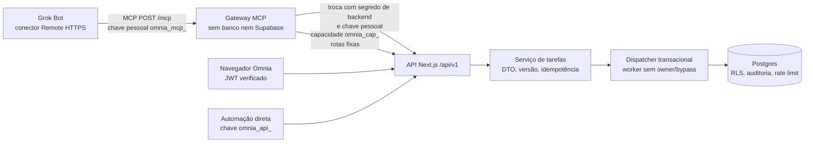

# Tarefas Omnia no Grok Bot

Esta integração usa a [API oficial de tarefas v1](../api/tasks-v1.md) e um serviço MCP HTTP independente. A implementação e os testes locais cobrem leitura, criação e atualização de tarefas; a conexão da conta Grok, a migração de produção e os deploys ainda são etapas de implantação. O contrato detalhado da API está em [OpenAPI 3.1](../api/tasks-v1.openapi.json) e os comandos do serviço estão no [README do MCP](../../apps/mcp-server/README.md).



O gateway apresenta exatamente seis ferramentas: `list_tasks`, `get_task`, `create_task`, `update_task`, `list_task_statuses` e `search_task_assignees`. Ele não possui conexão com o banco, SQL genérico, proxy arbitrário, exclusão, séries recorrentes, comentários ou anexos. Criação pelo MCP é uma tarefa independente; ele pode atualizar uma ocorrência recorrente já existente. A ferramenta `get_task` devolve `version` a partir do ETag da API; `update_task` exige essa versão e um `idempotencyKey` escolhido pelo cliente. `create_task` também exige chave de idempotência. Um 412 requer nova leitura antes de alterar. A API limita resposta JSON de upstream a 512 KiB e o gateway mede até 256 KiB do **conteúdo lógico serializado da ferramenta**; conteúdo textual e estruturado repetido no transporte pode tornar o wire total maior que 256 KiB. Diminua `limit` ou refine filtros quando houver `OUTPUT_TOO_LARGE`. A leitura do corpo upstream está dentro do timeout de cinco segundos; timeout antes dos headers pode resultar em 503, após headers/corpo em 504, conforme a fase.

O banco resolve a identidade de quem emitiu a chave, não uma identidade fictícia do bot. O dispatcher público é acessível somente pelo backend de serviço e chama uma função privada sob `omnia_tasks_worker`, papel sem login, sem ownership das tabelas e sem `BYPASSRLS`. RLS, guardas restritivas, permissão atual do menu `/tarefas`, negação explícita de usuário, privacidade (criador ou `ADMIN`), escopos da chave, revogação/expiração e limite de 120 requisições por usuário por minuto são verificados em cada operação. O registro de auditoria e a idempotência ocorrem na mesma transação da escrita. A troca MCP gera uma capacidade de até 15 minutos; o próximo pedido ainda revalida a chave mãe. `mine=true` apenas filtra atribuições do usuário já autorizado.

## Preparação e conexão

1. Faça revisão da migração [SQL de tarefas](../../supabase/migrations/20261002223637_tasks_api_transactional_security.sql) contra o esquema alvo e aplique-a pelo processo normal de migração. A migração **não foi aplicada em produção** neste trabalho. Execute as regressões isoladas com `bash supabase/tests/tasks-api/run.sh`; esse runner usa apenas o banco local controlado `omnia-tasks-api-test`. Não use `scripts/setup-local-test-env.sh` nesta verificação: ele sobrescreve configuração local da web e instala políticas de fixture mais permissivas.
2. Publique a API/artefato web depois da migração, mantendo `OMNIA_INTEGRATIONS_READ_ENABLED` e `OMNIA_INTEGRATIONS_WRITE_ENABLED` desligados. Configure as credenciais Supabase existentes somente no ambiente de deploy; `SUPABASE_SERVICE_ROLE_KEY` e `OMNIA_MCP_EXCHANGE_SECRET` são apenas de servidor. Gere um segredo de troca de alta entropia no gerenciador de segredos e configure o mesmo valor na API e no gateway. Verifique JWT humano, metadados de chave e os fluxos de recursos contra usuários de teste com permissões diferentes. A UI `/integracoes` permite qualquer usuário ativo criar e revogar suas próprias chaves; acesso às tarefas continua condicionado ao menu e aos escopos.
3. Publique **outro** projeto Vercel com Root Directory `apps/mcp-server`, Node 22+, endpoint público `https://<seu-host-mcp>/mcp`, `OMNIA_API_BASE_URL` apontando para a origem HTTPS da API, `OMNIA_MCP_ALLOWED_HOSTS` com hostnames públicos exatos e `OMNIA_MCP_ALLOWED_ORIGINS` apenas se um navegador autorizado enviar `Origin`. O serviço recusa redirecionamentos e não aceita URL arbitrária. O modo HTTP de localhost exige `NODE_ENV=development` junto com `OMNIA_MCP_ALLOW_INSECURE_LOCALHOST=true` e não serve para produção. Rotacione o segredo de troca nos dois serviços de forma coordenada; mantenha as flags desligadas durante a rotação e revalide o fluxo antes de religar.
4. Verifique na **conta Grok Bot alvo** que o conector Custom MCP `Remote HTTPS` pode enviar `Authorization: Bearer <chave>` a partir do armazenamento de segredos do produto. Essa capacidade específica de cabeçalho e o comportamento efetivo da conta ainda não foram testados; são bloqueio antes de habilitar a integração real. Configure a URL `/mcp` e o valor da chave **somente** nos campos protegidos do conector/segredo, nunca em chat, query string, URL, arquivo versionado ou exemplo compartilhado. A documentação oficial descreve [Team Bots e conectores Remote HTTPS](https://docs.x.ai/grok-bot/team-bots) e a [visão geral do Grok Bot](https://docs.x.ai/grok-bot/overview); a opção [Remote MCP da API xAI](https://docs.x.ai/developers/tools/remote-mcp) é outra superfície e não prova suporte no Grok Bot da conta. Este serviço usa bearer por chave, sem OAuth.
5. Prefira Bot pessoal/conector pessoal com uma chave `mcp` própria. Em um Team Bot, um conector configurado com chave/token usa o mesmo segredo para todas as conversas; todos agiriam com a permissão Omnia do dono dessa chave. A documentação do produto distingue isso de plugins com login por conta/OAuth. Não publique uma chave pessoal compartilhada como se cada colega estivesse autenticado individualmente. Comece com `tasks:read`; habilite `tasks:create` e `tasks:update` somente após validar o caso de uso. Ative a flag de leitura primeiro e depois a de escrita quando os testes correspondentes forem concluídos. As flags só ligam com o valor literal `true`; omissão ou qualquer outro valor mantém a integração fechada. O recurso de troca depende de ao menos uma flag ligada.

## Aceitação antes de liberar usuários

Use contas e dados controlados, sem segredos nos registros do teste. Registre status, `requestId`, ID da tarefa, versão e contagem de auditoria, nunca o token.

- Leia status e responsáveis; liste uma tarefa pública e teste `mine=true` com atribuição de outro usuário. Confirme que o filtro não aumenta acesso.
- Tente ler tarefa privada como usuário comum não criador (404/403 conforme visibilidade), como criador e como `ADMIN` com permissão válida. Teste negação explícita de menu e usuário desativado. Confirme que a ação é atribuída ao usuário dono da chave e que a notificação de atribuição usa essa identidade.
- Crie uma tarefa avulsa com uma chave de idempotência e repita **o mesmo** pedido: mesmo ID, uma tarefa e uma auditoria. Reuse a chave com payload diferente: 409. Campos de autor, contadores e recorrência via MCP devem ser rejeitados.
- Leia a tarefa criada, atualize com o ETag retornado e uma nova chave de idempotência; confirme alteração. Reuse o ETag antigo: 412 e nenhuma escrita. Teste concluir uma ocorrência recorrente sem alterar série alheia.
- Revogue a chave MCP e repita uma leitura imediatamente: falha na próxima requisição, inclusive se uma capacidade anterior ainda estiver dentro dos 15 minutos. Faça também uma tentativa após expiração e após desativar a flag relevante. O limite de 120/min por usuário deve retornar 429 com `Retry-After: 60`.
- Confira a sequência de criação, cópia única, descarte do segredo, revogação e substituição em `/integracoes`. Se a revogação da antiga falhar durante a substituição, a UI deve deixar a falha visível até a ação manual.

O teste de navegador isolado do repositório cobre essa última sequência com a página e o adaptador reais, autenticação e HTTP de teste controlados e Chromium real. Ele não valida sessão Next/Supabase implantada nem a conta Grok; os testes de cliente MCP e SQL isolado cobrem seus próprios limites.

## Esforço remanescente e riscos

| Fase operacional | Estimativa de planejamento | Principal risco/saída exigida |
| --- | --- | --- |
| Revisão do alvo, migração e API/UI | 1–2 dias | Diferenças de políticas/triggers e migração; regressões e respostas HTTP verificadas no ambiente alvo. |
| Deploy MCP e configuração segura | 0,5–1 dia | Host/Origin, segredo compartilhado e cabeçalho Authorization na conta Grok; conexão real verificada. |
| Piloto restrito e liberação gradual | 1–2 dias | Privacidade, auditoria, replay, versionamento e revogação; evidências do checklist e flags progressivas. |

Estas faixas são uma sugestão de execução para a implantação restante, não tempo de código já gasto nem garantia de compatibilidade da conta Grok. O maior bloqueio externo é confirmar a configuração segura de Authorization no produto alvo. Planeje rotação de chaves pessoais pela UI e do segredo de troca nos dois serviços. As tabelas privadas `sessions`, `audit`, `idempotency` e `rate_limits` persistem: **não existe job de retenção/pruning na migração**. Um operador com acesso privilegiado deve definir prazo com segurança/jurídico e executar manutenção revisada fora da API, preservando o horizonte de replay exigido para idempotência e a retenção de auditoria. Para dimensionar sem apagar nada, rode consultas somente leitura no ambiente autorizado, por exemplo:

```sql
BEGIN READ ONLY;
SELECT 'sessions' AS record_type, count(*) AS rows, min(created_at), max(created_at) FROM tasks_api_private.sessions
UNION ALL SELECT 'audit', count(*), min(created_at), max(created_at) FROM tasks_api_private.audit
UNION ALL SELECT 'idempotency', count(*), min(created_at), max(created_at) FROM tasks_api_private.idempotency
UNION ALL SELECT 'rate_limits', count(*), min(window_start), max(window_start) FROM tasks_api_private.rate_limits;
COMMIT;
```

Depois de aprovar prazos específicos, o operador deve preparar e revisar SQL de `DELETE` por tabela, com `WHERE` temporal, contagem prévia, transação e ensaio com `ROLLBACK` em cópia isolada. Não remova credenciais referenciadas por sessões, nem reduza o histórico de idempotência sem aceitar que chaves antigas possam voltar a produzir uma escrita. Nenhum comando de limpeza foi executado neste trabalho.
