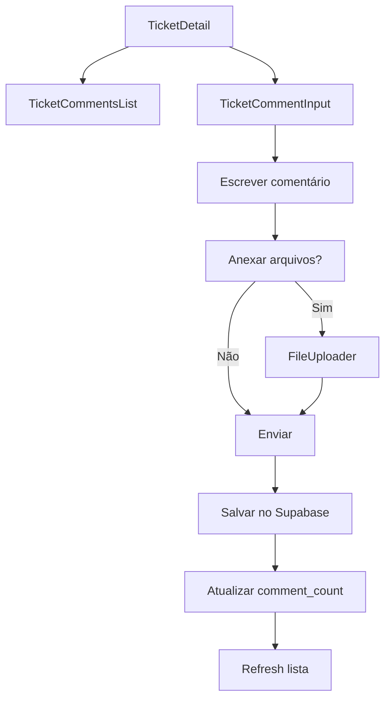

# Sistema de Tarefas - OMNIA

## Visão Geral

O sistema de tarefas do OMNIA é um módulo completo de gerenciamento de tickets/tarefas que permite criação, atribuição, acompanhamento e resolução de demandas dentro do sistema. Este documento serve como referência técnica completa para desenvolvimento e manutenção.

---

## 1. Mecanismos de Tarefas

### 1.1 Processo de Criação

#### Fluxo de Criação:
1. **Acesso**: Usuários autenticados com roles `ADMIN`, `SECRETARIO` ou `USUARIO` podem criar tarefas
2. **Formulário**: Preenchimento do `TicketForm` com validação via Zod
3. **Validação**: Campos obrigatórios (título, status) são validados
4. **Persistência**: Dados salvos via `tarefasRepoSupabase.create()`
5. **Notificação**: Feedback visual via toast/sonner
6. **Atualização**: Estado global atualizado via Zustand store

#### Campos Obrigatórios:
- **Título**: Descrição concisa da tarefa
- **Status**: Status inicial (padrão: "Aberto")

#### Campos Opcionais:
- **Descrição**: Detalhamento da tarefa
- **Prioridade**: ALTA, NORMAL (padrão), BAIXA
- **Data de Vencimento**: Prazo para conclusão
- **Responsável**: Usuário atribuído
- **Tags**: Categorização livre
- **Anexos**: Arquivos relacionados
- **Ticket**: Código/referência externa

### 1.2 Modelo Padrão

```typescript
interface Tarefa {
  id: string;                    // UUID gerado automaticamente
  title: string;                 // Título obrigatório
  description?: string;          // Descrição opcional
  priority: TarefaPrioridade;    // ALTA | NORMAL | BAIXA
  dueDate?: Date;               // Data de vencimento
  ticket?: string;              // Código/referência
  statusId: string;             // FK para omnia_ticket_statuses
  assignedTo?: UserRef;         // Usuário responsável
  createdBy?: UserRef;          // Criador da tarefa
  tags: string[];               // Array de tags
  commentCount: number;         // Contador de comentários
  createdAt: Date;              // Data de criação
  updatedAt: Date;              // Última atualização
  attachments?: Attachment[];   // Anexos da tarefa
  comments?: Comment[];         // Comentários da tarefa
}
```

### 1.3 Fluxo de Aprovação

#### Estados de Status:
1. **Aberto** (#ef4444) - Status inicial padrão
2. **Em Andamento** (#f59e0b) - Tarefa sendo executada
3. **Aguardando** (#6b7280) - Bloqueada/aguardando dependência
4. **Resolvido** (#10b981) - Concluída, aguardando validação
5. **Fechado** (#374151) - Finalizada definitivamente

#### Regras de Transição:
- Qualquer usuário autenticado pode alterar status
- Transições livres entre todos os estados
- Histórico mantido via `updated_at`
- Drag & drop disponível na interface (`TicketStatusList`)

---

## 2. Funcionalidades do Sistema

### 2.1 Descrição Técnica

#### Operações CRUD:
- **Create**: `tarefasRepoSupabase.create()` - Criação de novas tarefas
- **Read**: `tarefasRepoSupabase.list()` / `getById()` - Listagem e busca
- **Update**: `tarefasRepoSupabase.update()` - Atualização de campos
- **Delete**: `tarefasRepoSupabase.remove()` - Remoção (apenas ADMIN)

#### Funcionalidades Avançadas:
- **Busca Textual**: `searchTarefas()` com filtro por título/descrição
- **Filtros**: Por status, responsável, "minhas tarefas"
- **Tempo Real**: Listeners Supabase para atualizações automáticas
- **Anexos**: Upload, download, preview de imagens
- **Comentários**: Sistema completo com anexos
- **Tags**: Categorização flexível
- **Drag & Drop**: Reordenação de status

### 2.2 Requisitos Associados

#### Autenticação:
- Usuário deve estar autenticado (`auth.role() = 'authenticated'`)
- Perfil deve existir em `omnia_users`
- Roles válidas: `ADMIN`, `SECRETARIO`, `USUARIO`

#### Permissões:
- **Visualizar**: Todos os usuários autenticados
- **Criar**: ADMIN, SECRETARIO, USUARIO
- **Editar**: ADMIN, SECRETARIO, USUARIO
- **Excluir**: Apenas ADMIN
- **Comentar**: Todos os usuários autenticados

#### Performance:
- Paginação implícita via Supabase
- Índices em campos de busca
- Lazy loading de anexos e comentários

### 2.3 Fluxos de Trabalho

#### Fluxo Principal:
```mermaid
graph TD
    A[Usuário acessa /tickets] --> B[Lista carregada via loadTarefas]
    B --> C{Ação do usuário}
    C -->|Nova tarefa| D[/tickets/new]
    C -->|Editar| E[/tickets/:id]
    C -->|Filtrar| F[Aplicar filtros]
    C -->|Buscar| G[searchTarefas]
    D --> H[TicketForm]
    E --> H
    H --> I[Validação Zod]
    I --> J[Salvar no Supabase]
    J --> K[Atualizar store]
    K --> L[Feedback visual]
```

#### Fluxo de Comentários:


---

## 3. Arquitetura

### 3.1 Diagrama de Componentes

```
┌─────────────────────────────────────────────────────────────┐
│                        Frontend (React)                     │
├─────────────────────────────────────────────────────────────┤
│  Pages/                                                     │
│  ├── Tickets.tsx           (Lista principal)               │
│  ├── TicketNew.tsx         (Criação)                       │
│  └── TicketDetail.tsx      (Detalhes + comentários)        │
├─────────────────────────────────────────────────────────────┤
│  Components/tickets/                                        │
│  ├── TicketForm.tsx        (Formulário CRUD)               │
│  ├── TicketStatusList.tsx  (Drag & drop status)            │
│  ├── TicketStatusSelect.tsx (Seletor de status)            │
│  ├── TicketCommentsList.tsx (Lista comentários)            │
│  ├── TicketCommentInput.tsx (Input comentários)            │
│  ├── TicketAttachmentsList.tsx (Lista anexos)              │
│  └── TicketFileUploader.tsx (Upload anexos)                │
├─────────────────────────────────────────────────────────────┤
│  Store (Zustand)                                            │
│  ├── tarefas.store.ts      (Estado das tarefas)            │
│  └── tarefaStatus.store.ts (Estado dos status)             │
├─────────────────────────────────────────────────────────────┤
│  Repository                                                 │
│  ├── tarefasRepo.supabase.ts (CRUD tarefas)                │
│  └── tarefaStatusRepo.supabase.ts (CRUD status)            │
└─────────────────────────────────────────────────────────────┘
                                │
                                ▼
┌─────────────────────────────────────────────────────────────┐
│                     Backend (Supabase)                     │
├─────────────────────────────────────────────────────────────┤
│  Database Tables                                            │
│  ├── omnia_tickets         (Tarefas principais)            │
│  ├── omnia_ticket_statuses (Status das tarefas)            │
│  ├── omnia_ticket_comments (Comentários)                   │
│  ├── omnia_ticket_attachments (Anexos)                     │
│  └── omnia_users           (Usuários)                      │
├─────────────────────────────────────────────────────────────┤
│  Functions & Triggers                                       │
│  ├── update_ticket_comment_count() (Atualiza contador)     │
│  ├── handle_new_user() (Cria perfil automático)            │
│  └── update_updated_at_column() (Timestamp automático)     │
├─────────────────────────────────────────────────────────────┤
│  Row Level Security (RLS)                                   │
│  ├── Políticas de visualização                             │
│  ├── Políticas de criação                                  │
│  ├── Políticas de edição                                   │
│  └── Políticas de exclusão                                 │
└─────────────────────────────────────────────────────────────┘
```

### 3.2 Tecnologias Utilizadas

#### Frontend:
- **React 18**: Framework principal
- **TypeScript**: Tipagem estática
- **Vite**: Build tool e dev server
- **React Router**: Roteamento SPA
- **Zustand**: Gerenciamento de estado
- **React Hook Form**: Formulários
- **Zod**: Validação de schemas
- **Tailwind CSS**: Estilização
- **Shadcn/ui**: Componentes base
- **Sonner**: Notificações toast
- **dnd-kit**: Drag and drop
- **Lucide React**: Ícones

#### Backend:
- **Supabase**: BaaS (Backend as a Service)
- **PostgreSQL**: Banco de dados
- **Row Level Security**: Segurança nativa
- **Real-time**: WebSocket automático
- **Storage**: Armazenamento de arquivos

### 3.3 Padrões de Implementação

#### Repository Pattern:
```typescript
// Abstração da camada de dados
export const tarefasRepoSupabase = {
  async list(): Promise<Tarefa[]> { /* ... */ },
  async getById(id: string): Promise<Tarefa | null> { /* ... */ },
  async create(tarefa: Omit<Tarefa, 'id' | 'createdAt' | 'updatedAt' | 'commentCount'>): Promise<Tarefa> { /* ... */ },
  async update(id: string, tarefa: Partial<Tarefa>): Promise<Tarefa | null> { /* ... */ },
  async remove(id: string): Promise<boolean> { /* ... */ },
};
```

#### Store Pattern (Zustand):
```typescript
// Estado global reativo
interface TarefasStore {
  tarefas: Tarefa[];
  loading: boolean;
  error: string | null;
  loadTarefas: () => Promise<void>;
  createTarefa: (tarefa: Partial<Tarefa>) => Promise<Tarefa>;
  // ...
}
```

#### Component Composition:
```typescript
// Componentes especializados e reutilizáveis
<TicketDetail>
  <TicketForm />
  <TicketCommentsList>
    <TicketCommentInput />
  </TicketCommentsList>
  <TicketAttachmentsList>
    <TicketFileUploader />
  </TicketAttachmentsList>
</TicketDetail>
```

---

## 4. Estilos e Design

### 4.1 Guia de Estilo Visual

#### Paleta de Cores (Status):
- **Aberto**: `#ef4444` (Vermelho) - Urgência, ação necessária
- **Em Andamento**: `#f59e0b` (Âmbar) - Progresso, atenção
- **Aguardando**: `#6b7280` (Cinza) - Pausa, dependência
- **Resolvido**: `#10b981` (Verde) - Sucesso, conclusão
- **Fechado**: `#374151` (Cinza escuro) - Finalizado

#### Prioridades:
- **ALTA**: Badge vermelho, ícone de alerta
- **NORMAL**: Badge azul, sem ícone especial
- **BAIXA**: Badge cinza, ícone de baixa prioridade

#### Tipografia:
- **Títulos**: `font-semibold text-lg`
- **Descrições**: `text-sm text-muted-foreground`
- **Labels**: `text-sm font-medium`
- **Metadados**: `text-xs text-muted-foreground`

### 4.2 Componentes UI/UX

#### Cards e Containers:
```typescript
// Card principal de tarefa
<Card className="hover:shadow-md transition-shadow">
  <CardHeader>
    <CardTitle className="flex items-center justify-between">
      {/* Título + Status Badge */}
    </CardTitle>
  </CardHeader>
  <CardContent>
    {/* Conteúdo da tarefa */}
  </CardContent>
</Card>
```

#### Formulários:
```typescript
// Padrão de formulário com validação
<form onSubmit={handleSubmit(onSubmit)}>
  <div className="space-y-4">
    <div className="space-y-2">
      <Label htmlFor="title">Título *</Label>
      <Input
        id="title"
        {...register('title')}
        className={errors.title ? 'border-destructive' : ''}
      />
      {errors.title && (
        <p className="text-sm text-destructive">{errors.title.message}</p>
      )}
    </div>
  </div>
</form>
```

#### Listas e Grids:
```typescript
// Grid responsivo para anexos
<div className="grid grid-cols-2 md:grid-cols-3 lg:grid-cols-4 gap-4">
  {attachments.map(attachment => (
    <AttachmentCard key={attachment.id} attachment={attachment} />
  ))}
</div>
```

### 4.3 Padrões de Interação

#### Feedback Visual:
- **Loading States**: Spinners, skeleton loaders
- **Success**: Toast verde com ícone de check
- **Error**: Toast vermelho com mensagem específica
- **Hover**: Elevação sutil, mudança de cor

#### Navegação:
- **Breadcrumbs**: Contexto de localização
- **Back Button**: Retorno consistente
- **Deep Links**: URLs semânticas (`/tickets/:id`)

#### Responsividade:
- **Mobile First**: Design adaptativo
- **Breakpoints**: `sm:`, `md:`, `lg:`, `xl:`
- **Touch Targets**: Mínimo 44px para mobile

---

## 5. Estrutura de Dados

### 5.1 Diagrama de Tabelas

```sql
┌─────────────────────────┐
│     omnia_tickets       │
├─────────────────────────┤
│ id (UUID, PK)          │
│ title (TEXT, NOT NULL) │
│ description (TEXT)     │
│ priority (ENUM)        │
│ due_date (DATE)        │
│ ticket (TEXT)          │
│ status_id (UUID, FK)   │ ──┐
│ assigned_to (UUID, FK) │ ──┼─┐
│ created_by (UUID, FK)  │ ──┼─┼─┐
│ tags (TEXT[])          │   │ │ │
│ comment_count (INT)    │   │ │ │
│ created_at (TIMESTAMPTZ)│  │ │ │
│ updated_at (TIMESTAMPTZ)│  │ │ │
└─────────────────────────┘   │ │ │
                              │ │ │
┌─────────────────────────┐   │ │ │
│  omnia_ticket_statuses  │ ◄─┘ │ │
├─────────────────────────┤     │ │
│ id (UUID, PK)          │     │ │
│ name (TEXT, NOT NULL)  │     │ │
│ color (TEXT, NOT NULL) │     │ │
│ order_position (INT)   │     │ │
│ is_default (BOOLEAN)   │     │ │
│ created_at (TIMESTAMPTZ)│    │ │
│ updated_at (TIMESTAMPTZ)│    │ │
└─────────────────────────┘     │ │
                                │ │
┌─────────────────────────┐     │ │
│      omnia_users        │ ◄───┼─┘
├─────────────────────────┤     │
│ id (UUID, PK)          │ ◄───┘
│ auth_user_id (UUID, FK)│
│ name (TEXT, NOT NULL)  │
│ email (TEXT, UNIQUE)   │
│ avatar_url (TEXT)      │
│ roles (TEXT[])         │
│ color (TEXT)           │
│ created_at (TIMESTAMPTZ)│
│ updated_at (TIMESTAMPTZ)│
└─────────────────────────┘

┌─────────────────────────┐
│ omnia_ticket_comments   │
├─────────────────────────┤
│ id (UUID, PK)          │
│ ticket_id (UUID, FK)   │ ──┐
│ body (TEXT, NOT NULL)  │   │
│ created_by (UUID, FK)  │   │
│ created_at (TIMESTAMPTZ)│  │
│ author_id (UUID, FK)   │   │
└─────────────────────────┘   │
                              │
┌─────────────────────────┐   │
│omnia_ticket_attachments │   │
├─────────────────────────┤   │
│ id (UUID, PK)          │   │
│ ticket_id (UUID, FK)   │ ◄─┘
│ comment_id (UUID, FK)  │ ──┐
│ name (TEXT, NOT NULL)  │   │
│ url (TEXT, NOT NULL)   │   │
│ mime_type (TEXT)       │   │
│ size_kb (INTEGER)      │   │
│ uploaded_by (UUID, FK) │   │
│ created_at (TIMESTAMPTZ)│  │
└─────────────────────────┘   │
                              │
┌─────────────────────────┐   │
│ omnia_ticket_comments   │ ◄─┘
│ (referência comment_id) │
└─────────────────────────┘
```

### 5.2 Relacionamentos

#### Relacionamentos Principais:
1. **omnia_tickets → omnia_ticket_statuses** (N:1)
   - Cada tarefa tem um status
   - Status pode ser compartilhado por múltiplas tarefas

2. **omnia_tickets → omnia_users** (N:1) - assigned_to
   - Tarefa pode ter um responsável
   - Usuário pode ser responsável por múltiplas tarefas

3. **omnia_tickets → omnia_users** (N:1) - created_by
   - Tarefa tem um criador
   - Usuário pode criar múltiplas tarefas

4. **omnia_ticket_comments → omnia_tickets** (N:1)
   - Comentário pertence a uma tarefa
   - Tarefa pode ter múltiplos comentários

5. **omnia_ticket_attachments → omnia_tickets** (N:1)
   - Anexo pode pertencer diretamente à tarefa
   - Tarefa pode ter múltiplos anexos

6. **omnia_ticket_attachments → omnia_ticket_comments** (N:1)
   - Anexo pode pertencer a um comentário
   - Comentário pode ter múltiplos anexos

### 5.3 Tipos de Dados

#### Enums Customizados:
```sql
CREATE TYPE public.ticket_priority AS ENUM ('ALTA', 'NORMAL', 'BAIXA');
```

#### Tipos TypeScript Correspondentes:
```typescript
type TarefaPrioridade = 'ALTA' | 'NORMAL' | 'BAIXA';

interface UserRef {
  id: string;
  name: string;
  email: string;
  roles: string[];
  avatarUrl?: string;
  color?: string;
}

interface Attachment {
  id: string;
  name: string;
  url: string;
  mimeType?: string;
  sizeKb?: number;
  uploadedBy?: string;
  createdAt: Date;
}

interface Comment {
  id: string;
  body: string;
  authorId: string;
  createdBy?: string;
  createdAt: Date;
  attachments?: Attachment[];
}
```

#### Validações Zod:
```typescript
const ticketSchema = z.object({
  title: z.string().min(1, 'Título é obrigatório'),
  description: z.string().optional(),
  priority: z.enum(['ALTA', 'NORMAL', 'BAIXA']),
  dueDate: z.string().optional(),
  ticket: z.string().optional(),
  statusId: z.string().min(1, 'Status é obrigatório'),
  assignedTo: z.string().optional(),
});
```

---

## 6. Elementos de Banco de Dados

### 6.1 Triggers Documentados

#### 1. update_ticket_comment_count_trigger
```sql
CREATE OR REPLACE FUNCTION public.update_ticket_comment_count_new()
RETURNS TRIGGER AS $$
BEGIN
  IF TG_OP = 'INSERT' THEN
    UPDATE public.omnia_tickets 
    SET comment_count = comment_count + 1 
    WHERE id = NEW.ticket_id;
    RETURN NEW;
  ELSIF TG_OP = 'DELETE' THEN
    UPDATE public.omnia_tickets 
    SET comment_count = comment_count - 1 
    WHERE id = OLD.ticket_id;
    RETURN OLD;
  END IF;
  RETURN NULL;
END;
$$ LANGUAGE plpgsql;

CREATE TRIGGER update_ticket_comment_count_trigger
  AFTER INSERT OR DELETE ON public.omnia_ticket_comments
  FOR EACH ROW
  EXECUTE FUNCTION public.update_ticket_comment_count_new();
```
**Propósito**: Mantém o contador de comentários atualizado automaticamente

#### 2. update_tickets_updated_at
```sql
CREATE TRIGGER update_tickets_updated_at
BEFORE UPDATE ON public.omnia_tickets
FOR EACH ROW
EXECUTE FUNCTION public.update_updated_at_column();
```
**Propósito**: Atualiza automaticamente o campo `updated_at` em modificações

### 6.2 Funções Armazenadas

#### 1. handle_new_user()
```sql
CREATE OR REPLACE FUNCTION public.handle_new_user()
RETURNS TRIGGER
LANGUAGE plpgsql
SECURITY DEFINER SET search_path = ''
AS $$
BEGIN
  INSERT INTO public.omnia_users (auth_user_id, name, email, role)
  VALUES (
    NEW.id,
    COALESCE(NEW.raw_user_meta_data ->> 'name', NEW.email),
    NEW.email,
    'LEITOR'  -- Default role for new users
  );
  RETURN NEW;
END;
$$;
```
**Propósito**: Cria automaticamente perfil em `omnia_users` quando usuário se registra

#### 2. update_updated_at_column()
```sql
CREATE OR REPLACE FUNCTION public.update_updated_at_column()
RETURNS TRIGGER AS $$
BEGIN
  NEW.updated_at = now();
  RETURN NEW;
END;
$$ LANGUAGE plpgsql;
```
**Propósito**: Função genérica para atualizar timestamps

### 6.3 Procedures Importantes

#### Row Level Security (RLS) Policies

##### Tickets:
```sql
-- Visualização: Todos os usuários autenticados
CREATE POLICY "Anyone can view tickets" 
ON public.omnia_tickets 
FOR SELECT 
USING (auth.role() = 'authenticated'::text);

-- Criação: ADMIN, SECRETARIO, USUARIO
CREATE POLICY "Authenticated users can create tickets" 
ON public.omnia_tickets 
FOR INSERT 
WITH CHECK (EXISTS ( 
  SELECT 1 FROM omnia_users 
  WHERE omnia_users.auth_user_id = auth.uid() 
  AND omnia_users.roles && ARRAY['ADMIN'::text, 'SECRETARIO'::text, 'USUARIO'::text]
));

-- Edição: ADMIN, SECRETARIO, USUARIO
CREATE POLICY "Authenticated users can update tickets" 
ON public.omnia_tickets 
FOR UPDATE 
USING (EXISTS ( 
  SELECT 1 FROM omnia_users 
  WHERE omnia_users.auth_user_id = auth.uid() 
  AND omnia_users.roles && ARRAY['ADMIN'::text, 'SECRETARIO'::text, 'USUARIO'::text]
));

-- Exclusão: Apenas ADMIN
CREATE POLICY "Admins can delete tickets" 
ON public.omnia_tickets 
FOR DELETE 
USING (EXISTS ( 
  SELECT 1 FROM omnia_users 
  WHERE omnia_users.auth_user_id = auth.uid() 
  AND 'ADMIN'::text = ANY (omnia_users.roles)
));
```

##### Comentários:
```sql
-- Visualização: Todos os usuários autenticados
CREATE POLICY "Anyone can view ticket comments" 
ON public.omnia_ticket_comments 
FOR SELECT 
USING (auth.role() = 'authenticated'::text);

-- Criação: Todos os usuários autenticados
CREATE POLICY "Authenticated users can create ticket comments" 
ON public.omnia_ticket_comments 
FOR INSERT 
WITH CHECK (auth.role() = 'authenticated'::text);

-- Edição: Próprio autor ou ADMIN
CREATE POLICY "Users can update their own ticket comments" 
ON public.omnia_ticket_comments 
FOR UPDATE 
USING ((created_by = auth.uid()) OR (EXISTS ( 
  SELECT 1 FROM omnia_users
  WHERE ((omnia_users.auth_user_id = auth.uid()) AND ('ADMIN'::text = ANY (omnia_users.roles)))
)));

-- Exclusão: Próprio autor ou ADMIN
CREATE POLICY "Users can delete their own ticket comments or admins can delete any" 
ON public.omnia_ticket_comments 
FOR DELETE 
USING ((created_by = auth.uid()) OR (EXISTS ( 
  SELECT 1 FROM omnia_users
  WHERE ((omnia_users.auth_user_id = auth.uid()) AND ('ADMIN'::text = ANY (omnia_users.roles)))
)));
```

##### Anexos:
```sql
-- Visualização: Baseada no acesso ao comentário/tarefa
CREATE POLICY "Users can view ticket attachments" 
ON public.omnia_ticket_attachments 
FOR SELECT 
USING (
  auth.role() = 'authenticated'::text AND (
    -- Anexos diretos da tarefa (comment_id é null)
    comment_id IS NULL OR
    -- Anexos de comentários (verifica se pode ver o comentário)
    EXISTS (
      SELECT 1 FROM public.omnia_ticket_comments 
      WHERE id = comment_id
    )
  )
);

-- Upload: Todos os usuários autenticados
CREATE POLICY "Authenticated users can upload ticket attachments" 
ON public.omnia_ticket_attachments 
FOR INSERT 
WITH CHECK (auth.role() = 'authenticated'::text);

-- Exclusão: Próprio uploader ou ADMIN
CREATE POLICY "Users can delete their own ticket attachments or admins can delete any" 
ON public.omnia_ticket_attachments 
FOR DELETE 
USING (
  (uploaded_by = auth.uid()) OR 
  (EXISTS ( 
    SELECT 1 FROM omnia_users
    WHERE ((omnia_users.auth_user_id = auth.uid()) AND ('ADMIN'::text = ANY (omnia_users.roles)))
  ))
);
```

---

## 7. Exemplos Práticos e Casos de Uso

### 7.1 Caso de Uso: Criação de Tarefa

```typescript
// 1. Usuário preenche formulário
const formData = {
  title: "Implementar sistema de notificações",
  description: "Desenvolver módulo para envio de notificações por email",
  priority: "ALTA" as TarefaPrioridade,
  dueDate: new Date('2024-02-15'),
  assignedTo: { id: 'user-123', name: 'João Silva' },
  tags: ['desenvolvimento', 'backend', 'email']
};

// 2. Validação via Zod
const validatedData = ticketSchema.parse(formData);

// 3. Criação via store
const novaTarefa = await useTarefasStore.getState().createTarefa(validatedData);

// 4. Feedback visual
toast.success('Tarefa criada com sucesso!');

// 5. Redirecionamento
navigate(`/tickets/${novaTarefa.id}`);
```

### 7.2 Caso de Uso: Adição de Comentário com Anexo

```typescript
// 1. Usuário escreve comentário
const commentData = {
  body: "Anexando mockups da interface",
  ticketId: "ticket-456"
};

// 2. Upload de anexo
const attachment = await uploadFile(file);

// 3. Criação do comentário
const comment = await createComment({
  ...commentData,
  attachments: [attachment]
});

// 4. Atualização automática do contador via trigger
// comment_count é incrementado automaticamente

// 5. Atualização da UI via real-time
// Lista de comentários é atualizada automaticamente
```

### 7.3 Caso de Uso: Filtro e Busca

```typescript
// 1. Filtro por status
const tarefasAbertas = tarefas.filter(t => t.statusId === 'status-aberto');

// 2. Filtro "Minhas Tarefas"
const minhasTarefas = tarefas.filter(t => 
  t.assignedTo?.id === currentUser.id || 
  t.createdBy?.id === currentUser.id
);

// 3. Busca textual
const resultados = await useTarefasStore.getState().searchTarefas("notificações");

// 4. Combinação de filtros
const tarefasUrgentes = tarefas.filter(t => 
  t.priority === 'ALTA' && 
  t.dueDate && 
  t.dueDate < new Date()
);
```

### 7.4 Caso de Uso: Drag & Drop de Status

```typescript
// 1. Configuração do DnD
const sensors = useSensors(
  useSensor(PointerSensor),
  useSensor(KeyboardSensor)
);

// 2. Handler de drop
const handleDragEnd = async (event: DragEndEvent) => {
  const { active, over } = event;
  
  if (over && active.id !== over.id) {
    const tarefaId = active.id as string;
    const novoStatusId = over.id as string;
    
    // Atualização otimista
    setTarefas(prev => prev.map(t => 
      t.id === tarefaId ? { ...t, statusId: novoStatusId } : t
    ));
    
    // Persistência
    await updateTarefa(tarefaId, { statusId: novoStatusId });
  }
};
```

### 7.5 Caso de Uso: Real-time Updates

```typescript
// 1. Configuração do listener
useEffect(() => {
  const channel = supabase
    .channel('tickets-changes')
    .on(
      'postgres_changes',
      {
        event: '*',
        schema: 'public',
        table: 'omnia_tickets'
      },
      (payload) => {
        console.log('Mudança detectada:', payload);
        
        // Recarregar lista
        loadTarefas();
      }
    )
    .subscribe();

  return () => {
    supabase.removeChannel(channel);
  };
}, []);
```

---

## 8. Troubleshooting e Problemas Comuns

### 8.1 Problemas de Permissão

**Erro**: "new row violates row-level security policy"

**Solução**:
1. Verificar se usuário está autenticado
2. Confirmar se perfil existe em `omnia_users`
3. Validar roles do usuário
4. Revisar políticas RLS

### 8.2 Problemas de Performance

**Sintoma**: Carregamento lento da lista de tarefas

**Soluções**:
1. Implementar paginação
2. Adicionar índices em campos de busca
3. Otimizar queries com `select` específico
4. Usar lazy loading para anexos

### 8.3 Problemas de Estado

**Sintoma**: Estado desatualizado após operações

**Soluções**:
1. Verificar se `loadTarefas()` é chamado após mutações
2. Implementar atualizações otimistas
3. Usar listeners real-time
4. Validar se store está sendo usado corretamente

### 8.4 Problemas de Upload

**Sintoma**: Falha no upload de anexos

**Soluções**:
1. Verificar configuração do Supabase Storage
2. Validar políticas de storage
3. Confirmar tipos MIME permitidos
4. Verificar tamanho máximo de arquivo

---

## 9. Roadmap e Melhorias Futuras

### 9.1 Funcionalidades Planejadas

1. **Notificações Push**: Alertas em tempo real
2. **Relatórios**: Dashboard com métricas
3. **Templates**: Modelos de tarefa pré-definidos
4. **Automações**: Regras de negócio automáticas
5. **Integração**: APIs externas (Slack, Teams)
6. **Mobile App**: Aplicativo nativo

### 9.2 Otimizações Técnicas

1. **Cache**: Implementar cache inteligente
2. **Offline**: Suporte a modo offline
3. **PWA**: Progressive Web App
4. **Performance**: Lazy loading avançado
5. **SEO**: Server-side rendering
6. **Testes**: Cobertura de testes automatizados

---

## 10. Conclusão

Este documento serve como referência completa para o sistema de tarefas do OMNIA. Ele deve ser atualizado conforme novas funcionalidades são implementadas e mudanças arquiteturais são realizadas.

Para dúvidas ou contribuições, consulte a equipe de desenvolvimento ou abra uma issue no repositório do projeto.

**Última atualização**: Agosto 2025
**Versão do documento**: 1.0
**Responsável**: Equipe OMNIA Development